# Shelf-Wise

An e-commerce platform designed for book sales. It provides various functionalities for different user types, including administrator, customers, employees, and company representatives.

## Table of Contents

1. [Tech Stack](#tech-stack)
2. [Features](#features)
3. [Roles](#roles)
4. [Accounts for Tryout](#accounts-for-tryout)
5. [Setup Instructions](#setup-instructions)
6. [Usage and Testing](#usage-and-testing)
7. [Deployment](#deployment)
8. [Images](#images)

---

## Tech Stack

### Frontend

- **Bootstrap**
- **jQuery**
- **Toastr**: Real-time notifications and alert messages.
- **TinyMCE**: Rich text editor for content input.
- **DataTables**: Adds search and pagination to HTML tables.

### Backend

- **ASP.NET Core MVC (.NET 8)**
- **N-Tier Architecture**
- **Data Management Patterns**: Repository & UnitOfWork

### Database

- **MSSQL**: Local database for development.
- **Azure SQL Database**: Production database in Azure.

### Authentication & Authorization

- **ASP.NET Core Identity**: Role-based access and user authentication.
- **Facebook Login**: Enables social login.

### Payment & Email

- **Stripe**: Secure payment and refund processing.
- **Postmark**: Transactional email sending.

### Hosting

- **Azure**: Production hosting environment.

### Additional Libraries & Tools

- **Identity Scaffolding**: Razor Class Library for user authentication.
- **State Management**: TempData and ViewData for sharing data between views.
- **View Components**: Dynamic content rendering with ASP.NET Core View Components.

## Features

Shelf-Wise offers various features for users and admins:

- **User Management**: Create, manage, and assign roles to users. Manage companies information ( for company accounts ).
- **Product Management**: Add, edit book details, and manage books categories.
- **Authentication**: Login/Register via email/password or Facebook.
- **Stripe Integration**: Secure payments and refund processing.

## Roles

Shelf-Wise defines four distinct user roles with specific permissions:

1. **Role_Customer**: Standard customer with purchase access.
2. **Role_Admin**: Access to order and content management (categories, products, companies, users).
3. **Role_Company**: Similar to customers but with NET 30 payment terms for companies.
4. **Role_Employee**: Supports order management alongside admins.

## Accounts for Tryout

Here are test accounts for trying out the platform:

| Role     | Email              | Password |
| -------- | ------------------ | -------- |
| Company  | company@gmail.com  | P@ssw0rd |
| Employee | employee@gmail.com | P@ssw0rd |
| Customer | customer@gmail.com | P@ssw0rd |

## Setup Instructions

Follow these steps to set up Shelf-Wise on your local machine:

### 1. Clone the Repository

```bash
git clone https://github.com/kitepea/ShelfWise-MVC.git
cd ShelfWise-MVC
```

### 2. Configure App Settings

Fill in the required fields in `appsettings.json`:

```json
{
  "Logging": {
    "LogLevel": {
      "Default": "Information",
      "Microsoft.AspNetCore": "Warning"
    }
  },
  "AllowedHosts": "*",
  "ConnectionStrings": {
    "DefaultConnection": "Connection_String"
  },
  "Stripe": {
    "SecretKey": Stripe_SecretKey,
    "PublishableKey": Stripe_PublishableKey
  },
  "Facebook": {
    "AppId": Facebook_AppId,
    "AppSecret": Facebook_AppSecret
  },
  "PostMark": {
    "ServerApiToken": PostMark_Token
  }
}
```

### 3. Install Dependencies

Run the following command to install necessary NuGet packages:

```bash
dotnet restore
```

### 4. Build the Solution

Build the application using the .NET CLI:

```bash
dotnet build
```

### 5. Update Database

To apply migrations and create the database schema:

```bash
dotnet ef database update
```

### 6. Run the Application

Launch the application locally:

```bash
dotnet run
```

---

## Deployment

The Shelf-Wise application has been successfully deployed. You can access it using the following link (_sometimes I shut down the app service due to depleted SQL database resources_ :)):

https://shelfwise-e0g3fdfxhsb8brae.southeastasia-01.azurewebsites.net/

## Images

| 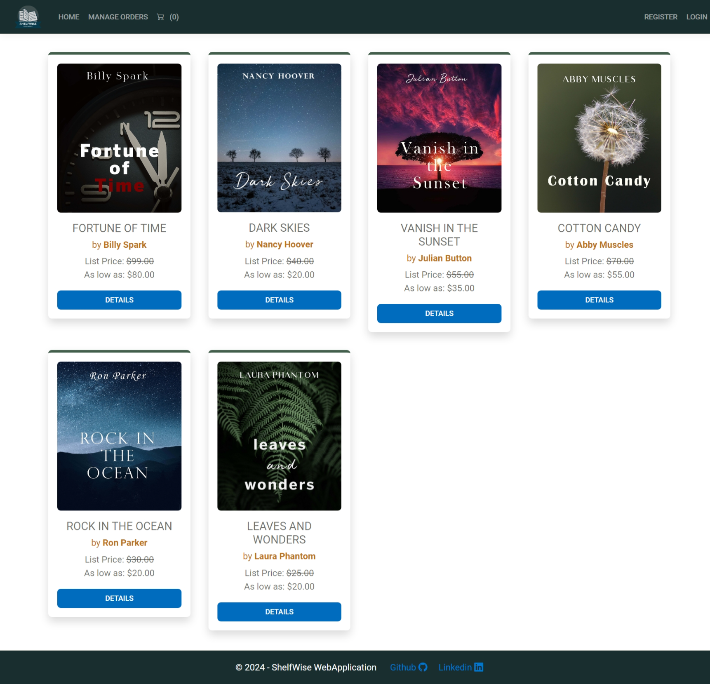     | 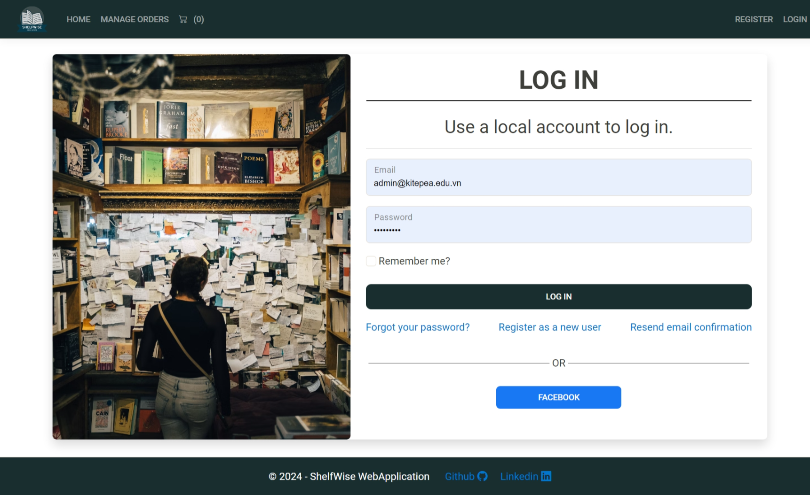   | 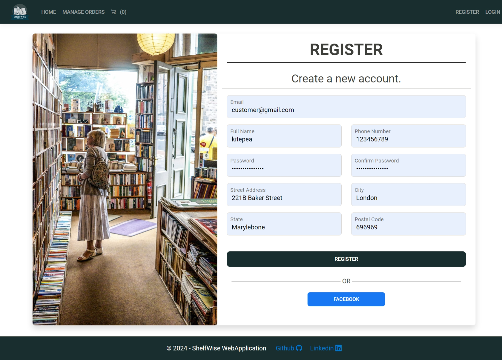   |
| -------------------------------- | -------------------------------- | -------------------------------- |
| 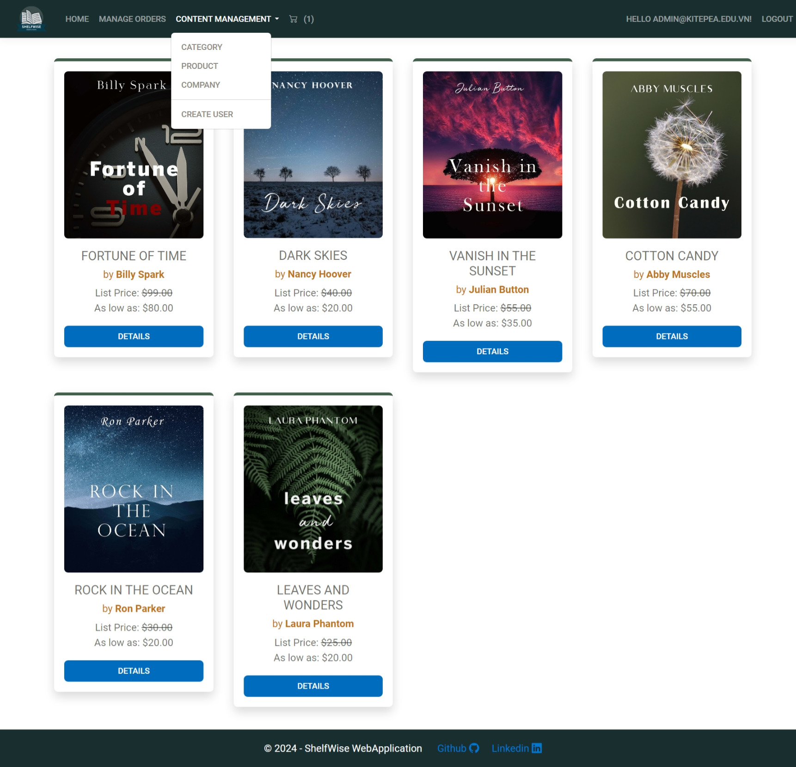   | 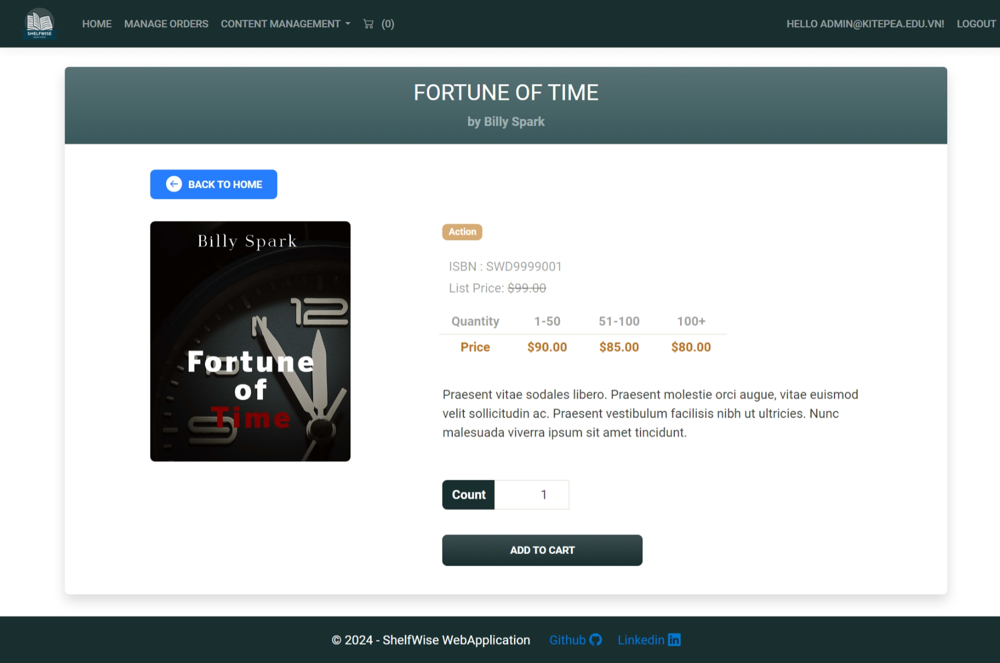  | 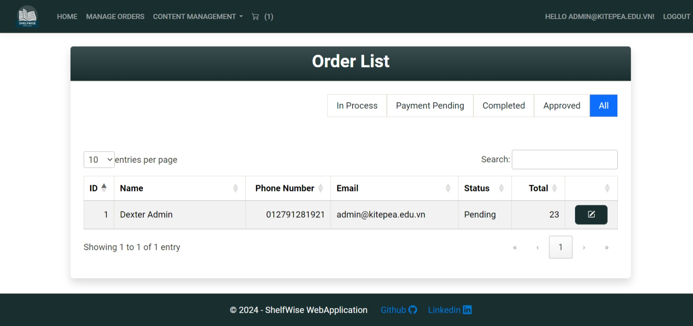   |
| 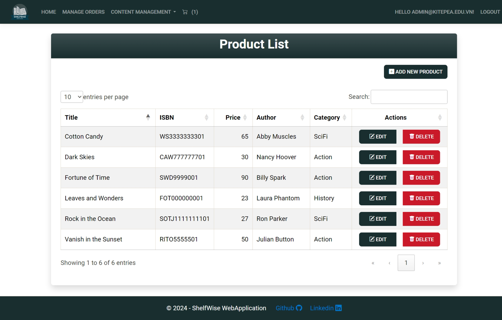   | 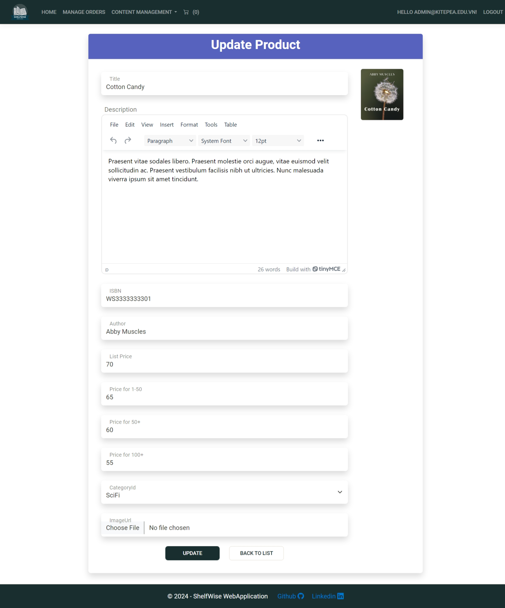 | 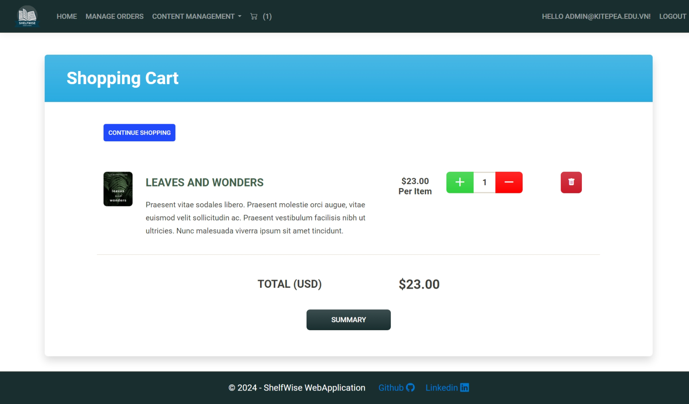   |
| 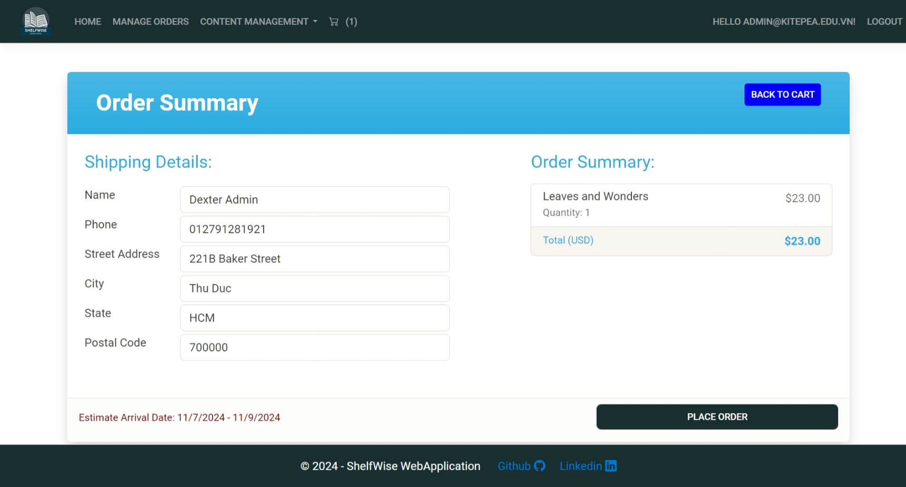   | 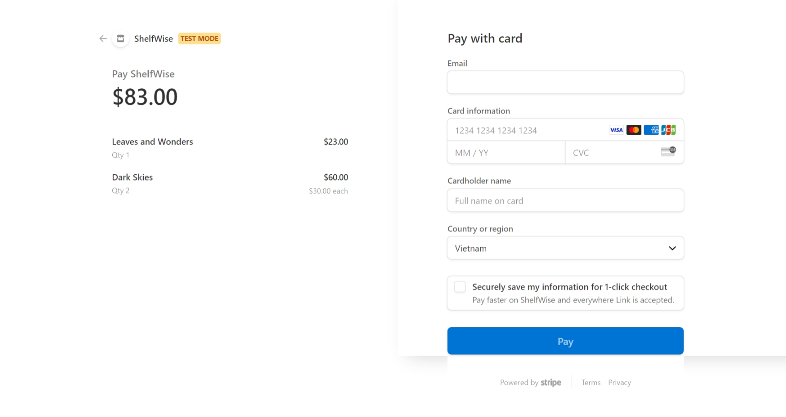  | 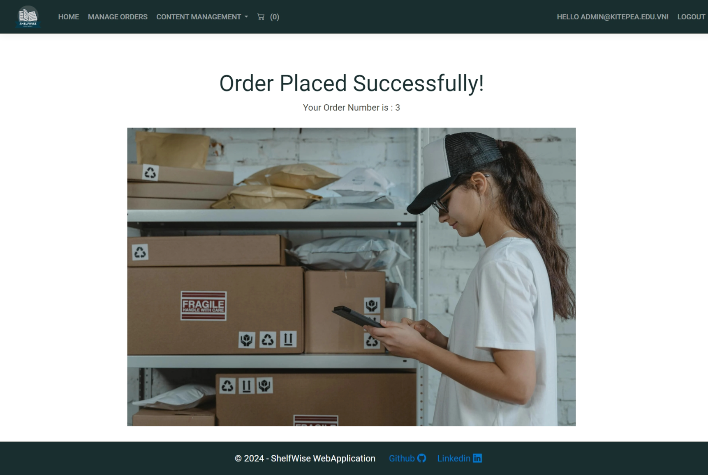  |
| 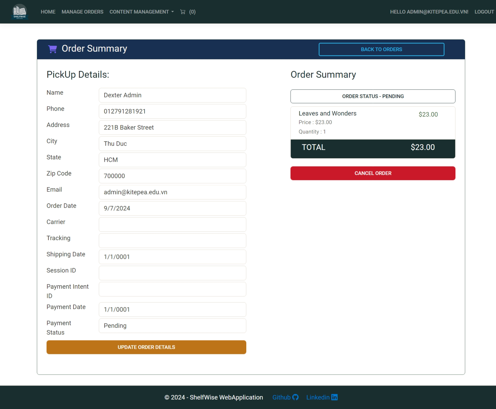 | 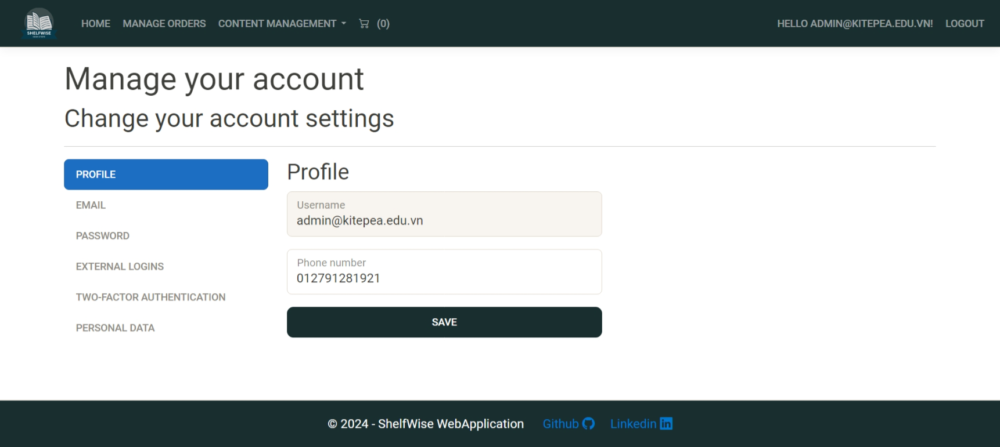 | 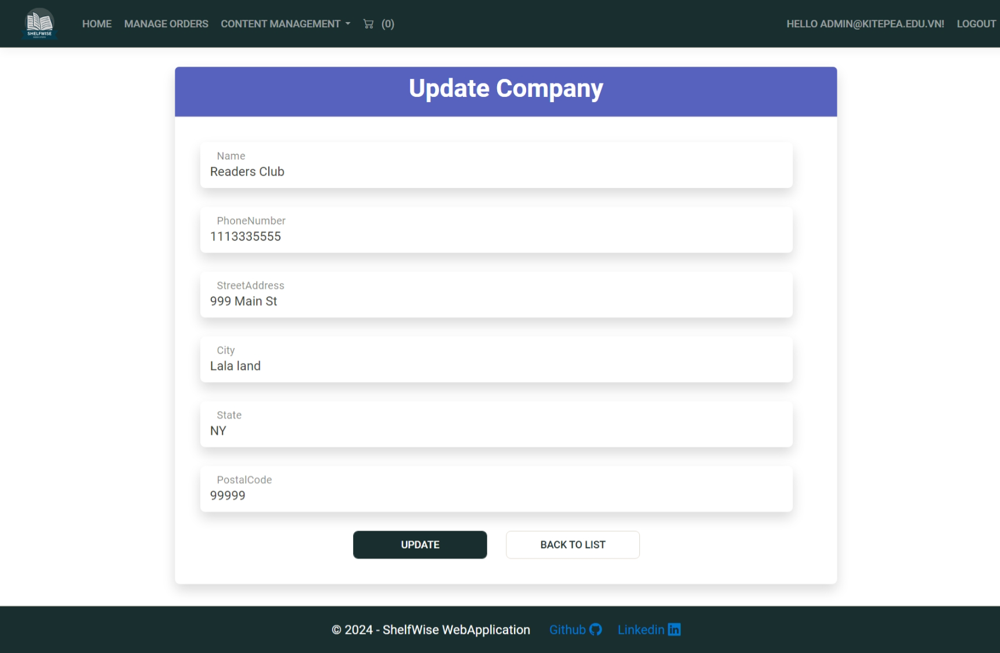 |
